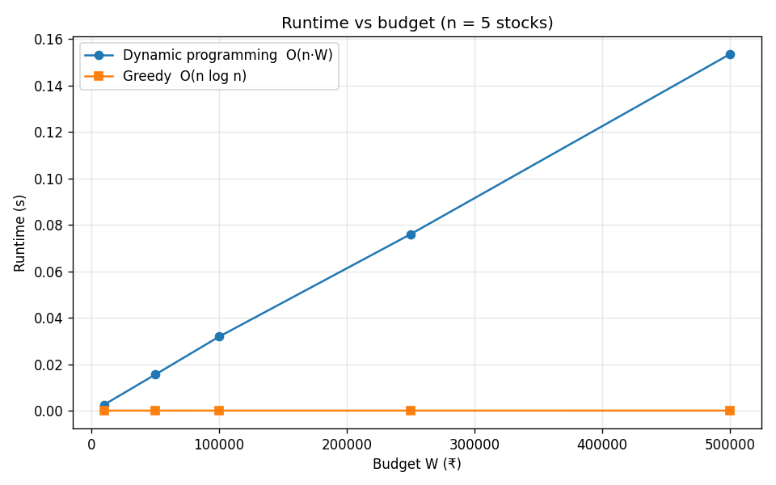

# Algorithmic Trading Strategy Simulator

An end-to-end simulator for Indian (NSE) stocks. It forecasts next-day prices
with linear regression, then allocates a budget across stocks by treating
portfolio construction as an **unbounded knapsack problem**. The allocation is
solved two ways, with a greedy heuristic and with dynamic programming, and the
two are compared on solution quality and runtime.

Course project for **Design and Analysis of Algorithms**, Mahindra University (November 2025).

## The problem

Each stock *i* has a share price *cᵢ* and an expected value
*vᵢ = cᵢ · (1 + rᵢ)*, where *rᵢ* is its assumed expected return. Given a
budget *W*, choose whole share counts *qᵢ ≥ 0* to

```
maximise   Σ vᵢ qᵢ
subject to Σ cᵢ qᵢ ≤ W
```

| | Greedy | Dynamic programming |
|---|---|---|
| Idea | Sort by value/cost ratio; buy as many shares of each stock as fit | `dp[w] = max(dp[w], dp[w − cᵢ] + vᵢ)` over all budgets 0…W |
| Time | O(n log n) | O(n · W) |
| Space | O(n) | O(W) |
| Optimal? | Not always | Always |

**Why greedy can fail:** with budget 10, stock A costs 6 and is worth 9
(ratio 1.5), while stock B costs 5 and is worth 7 (ratio 1.4). Greedy buys one
A for a value of 9 and leaves 4 unspent. The optimum is two B for 14. Greedy
commits to the best ratio without accounting for the budget it strands.

## Results

From `benchmarks/compare_algorithms.py`, over 500 random 5-stock universes
with a ₹20,000 budget:

| Metric | Value |
|---|---|
| Greedy found the optimum | 53.4 % of trials |
| Mean optimality gap | 0.84 % |
| Worst optimality gap | 10.64 % |

Greedy is usually close to optimal but fails in almost half the cases, by up
to 10.6 %. DP runtime grows linearly with the budget, as O(n·W) predicts,
from 3 ms at ₹10,000 to 0.15 s at ₹5,00,000. Greedy stays in microseconds
throughout.



Full tables: [`results/benchmark_results.md`](results/benchmark_results.md).

**On the five configured NSE stocks, greedy and DP agree.** Their assumed
returns (30–50 %) give one stock a clearly dominant value/cost ratio, and the
budget is large relative to share prices, so there is almost no stranded
budget for DP to recover. DP's advantage appears when ratios are close and
prices are large relative to the budget.

## Project structure

```
├── main.py                        CLI: fetch prices → predict → optimise → Excel report
├── simulator/
│   ├── config.py                  stock universe and assumed expected returns
│   ├── data.py                    Yahoo Finance price fetching
│   ├── prediction.py              linear-trend price forecast
│   ├── optimization.py            greedy and DP knapsack solvers
│   └── reporting.py               Excel report with embedded charts
├── tests/test_optimization.py     DP checked against brute force on 200 random cases
├── benchmarks/compare_algorithms.py   optimality gap and runtime experiments
├── results/                       benchmark output
├── examples/sample_prices.json    illustrative prices for offline runs
└── docs/final_report.pdf          project report
```

## Getting started

```bash
pip install -r requirements.txt
```

**Live data** (needs internet access to Yahoo Finance):

```bash
python main.py                                  # interactive prompts
python main.py --company TCS --budget 500000    # no prompts
python main.py --company TCS --budget 500000 --days-ahead 7   # week-ahead forecast
```

**Offline**, using the illustrative prices in `examples/` (skips prediction):

```bash
python main.py --budget 500000 --prices examples/sample_prices.json
```

Both modes print the greedy and DP allocations with runtimes and write
`outputs/trading_simulator_results.xlsx` with prediction, portfolio and
quantity sheets plus charts. Add `--no-excel` to skip the report.

**Tests and benchmark:**

```bash
pytest -q
python benchmarks/compare_algorithms.py
```

## Implementation notes

- **DP traceback in O(W) memory.** For each budget, the solver stores only the
  index of the last stock added and rebuilds the share counts by walking back
  from *W*. Storing a full list of purchases for every budget would take
  O(W²) memory in the worst case.
- **Chronological train/test split.** The price model is evaluated on the most
  recent 20 % of days. A random split would let the model train on days after
  the ones it is tested on, overstating accuracy.
- **Tested against brute force.** On 200 random small instances, the DP matches
  exhaustive search exactly, and greedy never beats it.

## Limitations and next steps

- **Expected returns are fixed assumptions**, set in `simulator/config.py`, not
  model outputs. The price forecast is reported separately and does not yet
  feed into the optimiser.
- **A linear trend on about 90 calendar days of closes is a weak forecaster.** It extrapolates
  recent drift and ignores volatility.
- **The model ignores risk.** It maximises expected value only, with no variance,
  diversification or transaction costs. A Markowitz mean-variance objective
  would address this.
- **DP cost scales with the budget in rupees.** Rounding prices to ₹10 or ₹100
  units shrinks *W* by 10–100× at a small cost in precision.

## Team

| Member | Roll number | Contribution |
|---|---|---|
| Pearl Mendapara | SE24UCAM043 | Coding and algorithm implementation |
| Harshil Pansala | SE24UCAM051 | Final report, presentation, algorithm development |
| Akash Raj | SE24UCAM054 | Presentation, theory and algorithm comparison |
| Amaan Rehman | SE24UCAM059 | Presentation and theory |
